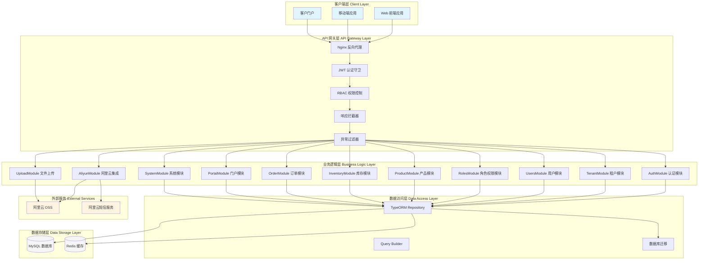
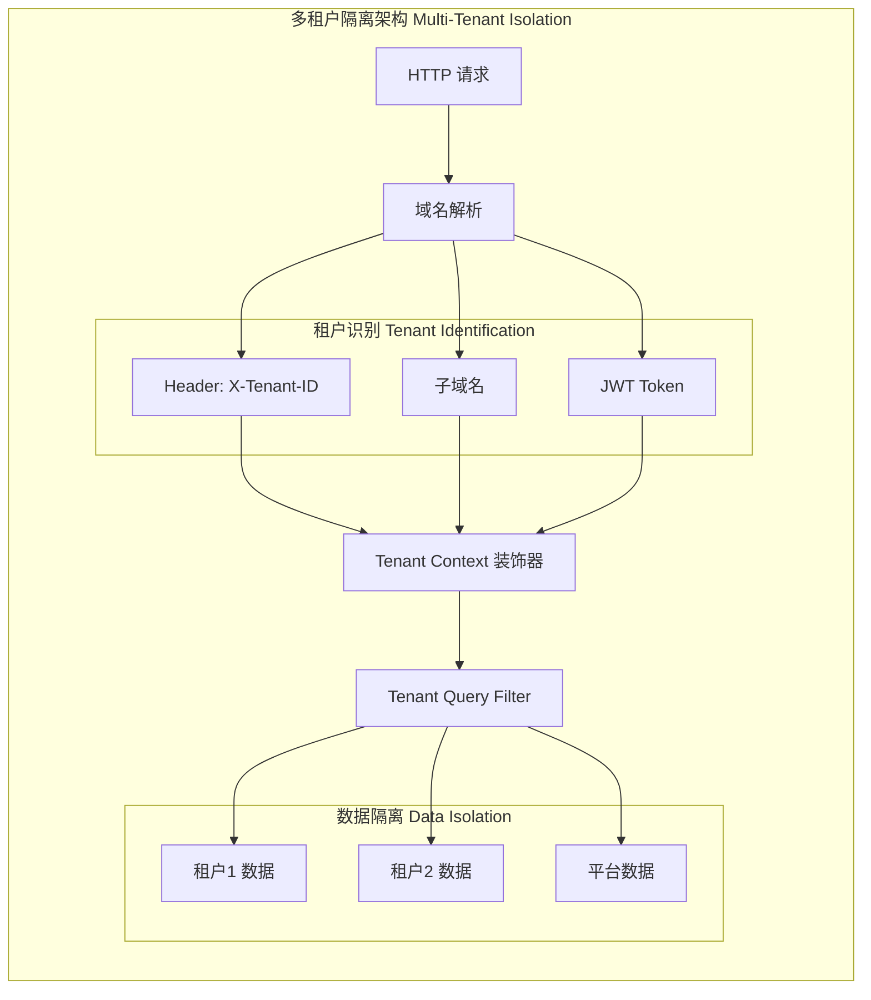
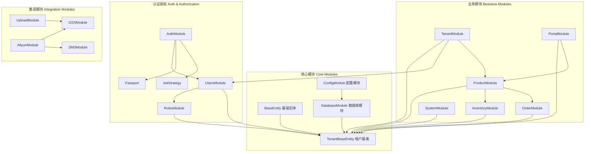
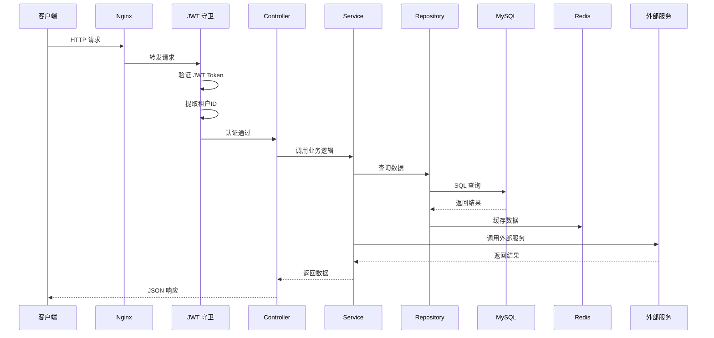
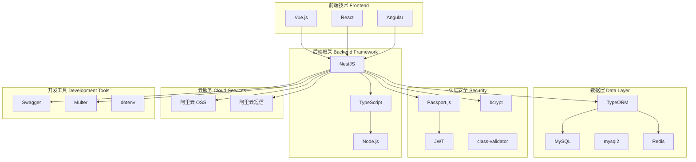
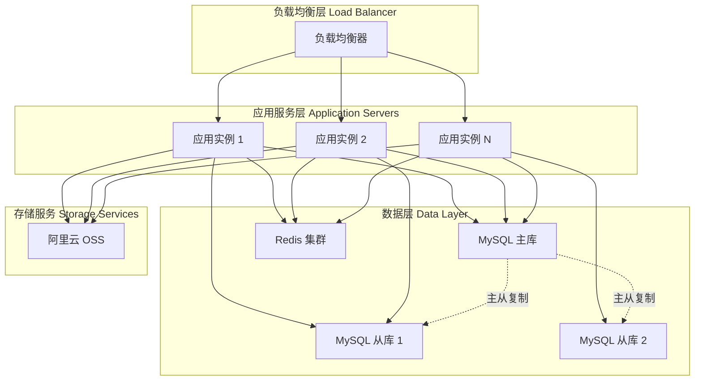
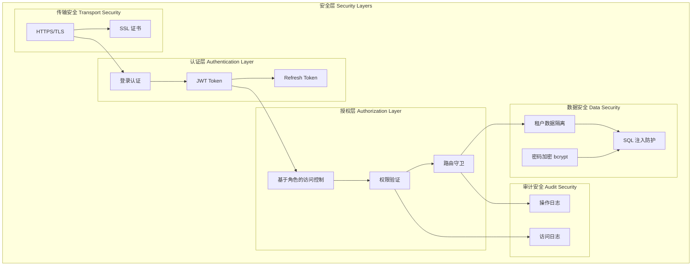

# WMS 后端系统架构图

## 系统整体架构

## 多租户架构

## 模块依赖关系

## 数据流架构

## 技术栈架构

## 部署架构

## 安全架构

---

## 架构说明

### 核心特性

1. **多租户架构 (Multi-Tenant Architecture)**
   - 基于 tenantId 的数据隔离
   - 支持平台管理员和租户用户两种角色
   - 租户通过域名、Header 或 JWT Token 识别

2. **模块化设计 (Modular Design)**
   - NestJS 模块化架构
   - 每个业务模块独立封装
   - 依赖注入实现松耦合

3. **分层架构 (Layered Architecture)**
   - 控制器层 (Controller)：处理 HTTP 请求
   - 服务层 (Service)：业务逻辑处理
   - 数据访问层 (Repository)：数据库操作

4. **安全机制 (Security)**
   - JWT 身份认证
   - RBAC 权限控制
   - bcrypt 密码加密
   - 租户数据隔离

5. **外部服务集成 (External Services)**
   - 阿里云 OSS 文件存储
   - 阿里云短信服务
