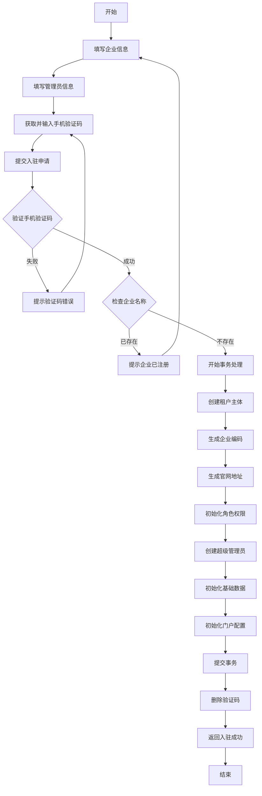

# 租户管理 PRD 文档

## 文档信息

| 项目 | 内容 |
|------|------|
| 文档名称 | 租户管理模块产品需求文档 |
| 产品名称 | M-WMS 多租户仓库管理系统 |
| 文档版本 | v1.0.0 |
| 创建日期 | 2024-01-27 |
| 产品类型 | SaaS 多租户 B2B WMS 系统 |

---

## 1. 产品概述

### 1.1 产品定位

M-WMS 是面向制造业的 SaaS 多租户仓库管理系统，支持多家工厂/企业在同一平台上独立运营，实现数据隔离、权限管控和独立门户展示。

### 1.2 目标用户

| 用户类型 | 描述 |
|----------|------|
| 平台超级管理员 | 负责管理所有租户，可进行租户入驻审核、信息维护等操作 |
| 租户管理员 | 各工厂/企业的管理员，管理本租户内的用户、权限、业务数据 |
| 租户普通用户 | 工厂/企业的普通员工，根据权限使用系统功能 |

### 1.3 核心价值

1. **多租户隔离**：实现企业级数据隔离，保障各租户数据安全
2. **快速入驻**：工厂可自助完成入驻，自动初始化完整的业务环境
3. **独立门户**：每个租户拥有独立的门户网站展示企业信息
4. **灵活权限**：支持角色模板和自定义权限配置

---

## 2. 业务流程

### 2.1 工厂入驻流程



### 2.2 租户数据隔离机制

```
┌─────────────────────────────────────────────────────────────┐
│                        平台层                                │
│  ┌─────────────────┐  ┌─────────────────┐  ┌─────────────┐ │
│  │  平台超级管理员  │  │     租户管理     │  │   系统配置   │ │
│  └─────────────────┘  └─────────────────┘  └─────────────┘ │
└─────────────────────────────────────────────────────────────┘
                            │
        ┌───────────────────┼───────────────────┐
        │                   │                   │
        ▼                   ▼                   ▼
┌───────────────┐   ┌───────────────┐   ┌───────────────┐
│    租户 A     │   │    租户 B     │   │    租户 C     │
│  (tenantId=A) │   │  (tenantId=B) │   │  (tenantId=C) │
│ ┌───────────┐ │   │ ┌───────────┐ │   │ ┌───────────┐ │
│ │ 用户 A1   │ │   │ │ 用户 B1   │ │   │ │ 用户 C1   │ │
│ │ 用户 A2   │ │   │ │ 用户 B2   │ │   │ │ 用户 C2   │ │
│ └───────────┘ │   │ └───────────┘ │   │ └───────────┘ │
│ ┌───────────┐ │   │ ┌───────────┐ │   │ ┌───────────┐ │
│ │ 产品数据  │ │   │ │ 产品数据  │ │   │ │ 产品数据  │ │
│ │ 库存数据  │ │   │ │ 库存数据  │ │   │ │ 库存数据  │ │
│ └───────────┘ │   │ └───────────┘ │   │ └───────────┘ │
│ ┌───────────┐ │   │ ┌───────────┐ │   │ ┌───────────┐ │
│ │ 门户配置  │ │   │ │ 门户配置  │ │   │ │ 门户配置  │ │
│ └───────────┘ │   │ └───────────┘ │   │ └───────────┘ │
└───────────────┘   └───────────────┘   └───────────────┘
```

---

## 3. 功能需求

### 3.1 工厂入驻（租户注册）

#### 3.1.1 用户故事

> 作为一个工厂负责人，我希望能够在平台上快速注册入驻，自动创建我的企业账号和管理环境，以便立即开始使用系统。

#### 3.1.2 功能描述

| 功能点 | 描述 | 优先级 |
|--------|------|--------|
| 企业信息填写 | 支持填写企业全称、行业、联系人、电话等基本信息 | P0 |
| 管理员账号设置 | 设置初始管理员账号和密码 | P0 |
| 手机验证码 | 通过手机验证码验证联系人身份 | P0 |
| 自动编码生成 | 自动生成企业唯一编码 | P1 |
| 自动生成官网 | 根据环境自动生成租户官网地址 | P1 |

#### 3.1.3 页面字段

**必填字段**
- 企业名称
- 企业编码（如不填自动生成）
- 联系电话
- 手机验证码
- 管理员账号
- 管理员密码

**选填字段**
- 行业分类/行业代码
- 联系人
- 工厂地址
- 公司注册地址
- 官网
- 备注
- 税号、纳税人类型
- 统一社会信用代码
- 开户行、银行账号
- 营业执照信息
- 法人代表、注册资本
- 资质证书信息
- 联系邮箱、传真
- 成立日期、员工人数
- 主要产品、年产能

#### 3.1.4 业务规则

1. **企业编码规则**
   - 格式：`ENT_{企业简拼}_{4位随机码}`
   - 字符集：大写字母+数字（排除易混淆字符 0,O,1,I）
   - 唯一性：全局唯一

2. **官网地址规则**
   - 生产环境：`https://pinmalink.com/portal/{code}/zh`
   - 开发环境：`https://dev.pinmalink.com/portal/{code}/zh`

3. **管理员账号规则**
   - 最少4位字符
   - 租户内唯一

4. **验证码规则**
   - 6位数字
   - 有效期5分钟
   - 使用后立即失效

#### 3.1.5 自动初始化内容

| 内容类型 | 说明 |
|----------|------|
| 角色 | 系统管理员、仓库主管、生产组长 |
| 权限 | 根据角色模板分配对应权限 |
| 管理员用户 | 使用提交的账号密码创建 |
| 基础单位 | 个、件、箱、套、kg、g、吨、米等 |
| 产品类目 | 默认类目结构 |
| 产品属性 | 常用属性模板 |
| 门户配置 | 基于企业信息的默认配置 |

---

### 3.2 租户列表查询

#### 3.2.1 用户故事

> 作为平台管理员，我希望能够查看所有入驻的租户列表，以便了解平台整体运营情况。

#### 3.2.2 功能描述

| 功能点 | 描述 | 优先级 |
|--------|------|--------|
| 分页查询 | 支持分页查询租户列表 | P0 |
| 列表展示 | 显示租户核心信息 | P0 |
| 排序 | 默认按创建时间倒序 | P1 |

#### 3.2.3 列表字段

- 租户ID
- 企业编码
- 企业名称
- 行业代码
- 联系人
- 联系电话
- 激活状态
- 创建时间
- 更新时间

---

### 3.3 租户详情查看

#### 3.3.1 用户故事

> 作为平台管理员，我希望能够查看租户的详细信息，以便进行审核和管理。

#### 3.3.2 功能描述

| 功能点 | 描述 | 优先级 |
|--------|------|--------|
| 详情查询 | 根据租户ID查询详细信息 | P0 |
| 行业名称解析 | 将行业代码解析为行业名称 | P1 |

#### 3.3.3 详情字段

包含所有租户实体字段，详见 API 文档。

---

### 3.4 租户信息修改

#### 3.4.1 用户故事

> 作为平台管理员，我希望能够修改租户信息，以便纠正错误或更新企业资料。

#### 3.4.2 功能描述

| 功能点 | 描述 | 优先级 |
|--------|------|--------|
| 信息更新 | 支持更新除id/code外的所有字段 | P0 |
| 门户配置同步 | 更新后自动同步门户配置 | P1 |

#### 3.4.3 业务规则

1. 不允许修改的字段：`id`、`code`、`createdAt`、`updatedAt`
2. 日期字段特殊处理：空字符串转换为 null
3. 更新后重新生成门户配置

---

### 3.5 租户删除

#### 3.5.1 用户故事

> 作为平台管理员，我希望能够删除租户（软删除），以便清理无效或违规企业。

#### 3.5.2 功能描述

| 功能点 | 描述 | 优先级 |
|--------|------|--------|
| 软删除 | 标记删除，不物理删除数据 | P0 |
| 删除验证 | 删除前验证租户是否存在 | P0 |

---

## 4. 非功能需求

### 4.1 性能要求

| 指标 | 要求 |
|------|------|
| 并发入驻 | 支持100+并发入驻请求 |
| 查询响应 | 列表查询<500ms，详情查询<200ms |
| 数据库连接 | 使用连接池，支持高并发 |

### 4.2 安全要求

| 项目 | 要求 |
|------|------|
| 数据隔离 | 租户间数据完全隔离 |
| 密码加密 | 使用 bcrypt 加密，盐值10轮 |
| 验证码 | 验证码加密存储，使用后立即失效 |
| SQL注入 | 使用 ORM 防止 SQL 注入 |
| 权限控制 | 接口级别的权限验证 |

### 4.3 可用性要求

| 项目 | 要求 |
|------|------|
| 事务一致性 | 入驻流程使用数据库事务 |
| 异常处理 | 完善的异常捕获和错误提示 |
| 日志记录 | 关键操作记录日志 |

---

## 5. 数据模型

### 5.1 租户实体 (Tenant)

| 字段 | 类型 | 必填 | 说明 |
|------|------|------|------|
| id | UUID | 是 | 主键 |
| code | string(50) | 是 | 企业唯一编码（唯一索引） |
| name | string | 是 | 企业全称（唯一） |
| industryCode | string(50) | 否 | 所属行业代码 |
| contactPerson | string | 否 | 联系人 |
| contactPhone | string | 否 | 联系电话 |
| address | text | 否 | 工厂详细地址 |
| factoryAddress | text | 否 | 工厂地址（别名） |
| registerAddress | text | 否 | 公司注册地址 |
| website | string | 否 | 官网 |
| remark | text | 否 | 备注 |
| taxNo | string(50) | 否 | 税号 |
| taxpayerType | string | 否 | 纳税人类型 |
| creditCode | string(100) | 否 | 统一社会信用代码 |
| bankName | string | 否 | 开户行 |
| bankAccount | string | 否 | 银行账号 |
| businessLicenseNo | string(100) | 否 | 营业执照号 |
| businessLicenseExpire | date | 否 | 营业执照有效期 |
| legalPerson | string | 否 | 法人代表 |
| registeredCapital | string | 否 | 注册资本 |
| industryType | string | 否 | 行业分类 |
| qualificationNo | string(100) | 否 | 资质证书编号 |
| qualificationExpire | date | 否 | 资质证书有效期 |
| email | string | 否 | 联系邮箱 |
| fax | string | 否 | 传真 |
| foundDate | date | 否 | 成立日期 |
| staffCount | int | 否 | 员工人数 |
| mainProducts | text | 否 | 主要产品 |
| annualCapacity | string | 否 | 年产能 |
| isActive | tinyint | 是 | 激活状态（1/0），默认1 |
| createdAt | datetime | 是 | 创建时间 |
| updatedAt | datetime | 是 | 更新时间 |
| deletedAt | datetime | 否 | 删除时间（软删除） |

### 5.2 关联实体

**租户基础实体 (TenantBaseEntity)**

所有需要租户隔离的业务实体都继承此基类：

```typescript
abstract class TenantBaseEntity extends BaseEntity {
  tenantId: string | null;  // 租户ID，平台管理员为null
}
```

**继承此基类的实体**：

| 实体 | 说明 |
|------|------|
| User | 用户（租户内用户名唯一） |
| Role | 角色 |
| Unit | 单位 |
| Product | 产品 |
| Inventory | 库存 |
| PortalConfig | 门户配置 |

---

## 6. 角色与权限

### 6.1 角色模板

| 角色代码 | 角色名称 | 说明 |
|----------|----------|------|
| ADMIN | 系统管理员 | 拥有所有权限 |
| WH_MANAGER | 仓库主管 | 仓库管理相关权限 |
| PROD_LEADER | 生产组长 | 库存管理相关权限 |

### 6.2 权限类别

| 类别 | 权限代码 |
|------|----------|
| 租户管理 | tenant:list, tenant:detail, tenant:update, tenant:delete |
| 用户管理 | user:list, user:detail, user:create, user:update, user:delete |
| 角色管理 | role:list, role:detail, role:create, role:update, role:delete |
| 产品管理 | product:list, product:detail, product:create, product:update, product:delete |
| 库存管理 | inventory:list, inventory:detail, inventory:create, inventory:update, inventory:delete |
| 单位管理 | unit:list, unit:detail, unit:create, unit:update, unit:delete |

---

## 7. 接口清单

| 接口 | 方法 | 路径 | 认证 |
|------|------|------|------|
| 工厂入驻 | POST | /tenants/onboard | 否 |
| 租户列表 | POST | /tenants/list | 是 |
| 租户详情 | POST | /tenants/detail | 是 |
| 修改租户 | PATCH | /tenants/:id | 是 |
| 删除租户 | DELETE | /tenants/:id | 是 |

详见《租户管理API接口文档.md》

---

## 8. 版本规划

### v1.0.0 (当前版本)

- 工厂入驻功能
- 租户 CRUD 基础功能
- 角色权限自动初始化
- 基础数据自动初始化
- 门户配置自动生成

### v1.1.0 (规划中)

- 租户审核流程
- 租户启用/禁用
- 租户数据统计
- 租户续费管理

### v1.2.0 (规划中)

- 租户自定义域名
- 租户自定义品牌配置
- 租户数据导出/迁移
- 租户操作日志

---

## 9. 附录

### 9.1 名词解释

| 术语 | 解释 |
|------|------|
| 租户 | 使用系统的企业/工厂组织，是数据隔离的基本单位 |
| 租户ID | UUID格式的租户唯一标识 |
| 企业编码 | 用于登录识别的租户编码，全局唯一 |
| 平台超级管理员 | 拥有跨租户管理权限的系统管理员 |
| SaaS | Software as a Service，软件即服务 |
| 软删除 | 逻辑删除，不物理删除数据 |

### 9.2 相关文档

- [租户管理API接口文档.md](./租户管理API接口文档.md)
- [系统操作手册.md](./系统操作手册.md)
